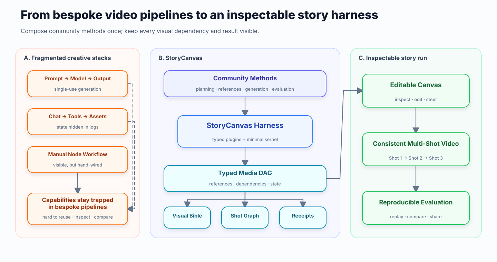
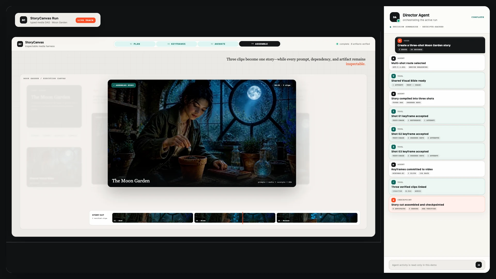
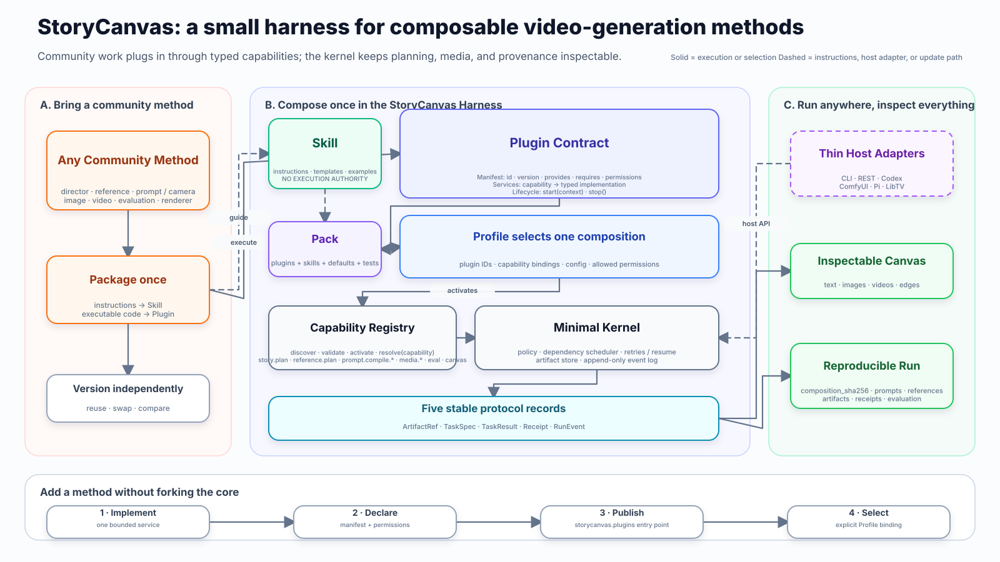

<div align="center">
  
  <h1>StoryCanvas Harness</h1>
  <p><strong>A composable, inspectable runtime for agentic story-video pipelines.</strong></p>
  <p>
    <a href="README_ZH.md">中文</a> ·
    <a href="docs/ARCHITECTURE.md">Architecture</a> ·
    <a href="docs/PLUGIN_ARCHITECTURE.md">Plugins</a> ·
    <a href="docs/COMFYUI.md">ComfyUI</a>
  </p>
  <p>
    <a href="https://github.com/Mrakas/ComfyUI-StoryCanvas-Harness/actions/workflows/ci.yml"></a>
    <a href="LICENSE"></a>
    
  </p>
</div>

StoryCanvas is not a video model. It is the harness that turns planning, reference selection,
image generation, video generation, and evaluation methods into a **typed media DAG**. The DAG
keeps prompts, visual state, dependencies, artifacts, receipts, and SHA-256 provenance available
after an agent finishes—rather than burying them in a bespoke script or one-shot trace.

<p align="center">
  
</p>

<p align="center"><strong>Figure 1.</strong> Community methods become replaceable modules inside one maintained harness; their intermediate media state remains visible as an editable Canvas, consistent multi-shot video, and reproducible evaluation.</p>

The canonical 13-node figure is generated from a deterministic
[FigureSpec](figures/specs/storycanvas-figure1.json). The lower-level
[implementation topology](figures/storycanvas-topology.svg) lives in the architecture guide.

## See the Canvas, not just the claim

<p align="center">
  <a href="assets/demo/storycanvas-pipeline-demo-v3.mp4"></a>
</p>

<p align="center"><a href="assets/demo/storycanvas-pipeline-demo-v3.mp4"><strong>Watch the 28-second MP4</strong></a> · <a href="examples/moon_garden_canvas/index.html">Inspect the standalone Canvas files</a></p>

The Moon Garden demo is a sanitized real run: one Story Prompt, a Visual Bible, three Shot
Prompts, four generated images, explicit previous-shot/reference edges, three MiniMax-H3 videos,
and an assembled Story video. The Viewer is local-only and read-only: `Reset`, `Next`, and `Play`
reveal the graph without calling a provider or spending money.

## Why StoryCanvas

- **Composable.** Swap a Director, prompt compiler, reference planner, generator, evaluator, or
  host adapter through typed Plugin capabilities instead of rewriting the pipeline.
- **Inspectable.** Prompts, ordered references, persistent visual state, dependencies, retries,
  media, and receipts remain visible in ComfyUI or the standalone Canvas Viewer.
- **Reproducible.** Profiles bind exact Plugins; composition, request, reference, artifact, and
  output hashes prevent incompatible cache reuse and make runs replayable.

## Quick start

Requires Python 3.10–3.13 and [uv](https://docs.astral.sh/uv/).

```bash
git clone https://github.com/Mrakas/ComfyUI-StoryCanvas-Harness.git
cd ComfyUI-StoryCanvas-Harness
uv sync

# Check local dependencies and configuration; no provider calls.
uv run storycanvas doctor

# Generate three mock shots and open their Canvas. No keys or GPU needed.
uv run storycanvas demo --open

# Optional: add local mock videos (requires ffmpeg and ffprobe).
uv run storycanvas demo --with-video --open
```

`demo` always uses the bundled mock Profile, even if API keys are configured. It prints the
Canvas, Run manifest, and audit paths; outputs default to `output/demo`. Repeating
it reuses verified artifacts and preserves other runs. Both demo inputs and the Profile ship
inside the Python wheel, so the same commands work outside a repository checkout.

For a custom story, provider configuration, video continuation, and machine-readable CLI
results, follow the [Getting started guide](docs/GETTING_STARTED.md). For native custom nodes,
see the [ComfyUI guide](docs/COMFYUI.md). The [roadmap](docs/ROADMAP.md) separates this release's
foundation work from proposed features.

## Four concepts

| Concept | Responsibility |
|---|---|
| **Skill** | Instructions, examples, templates, and assets; no execution authority by itself. |
| **Plugin** | A typed capability such as `story.plan`, `reference.plan`, `media.image.generate`, `media.video.generate`, `evaluation.run`, or `canvas.render`. |
| **Profile** | Exact Plugin selection, capability bindings, configuration, permissions, and a composition SHA for one reproducible runtime. |
| **Media DAG** | The durable graph of prompts, visual state, dependencies, artifacts, receipts, and results shared across hosts. |

<p align="center">
  
</p>

<p align="center"><strong>Plugin architecture.</strong> A community method is packaged once as instructions or a typed capability, selected by a Profile, and executed by the minimal Kernel without forking the core.</p>

The Kernel owns lifecycle, dependency resolution, budgets, validation, cache, and receipts. Host
adapters expose the same composition through Python, CLI, REST, Codex, ComfyUI, or a future Pi /
DeepSeek Harness / LibTV integration. See the [Plugin contract](specs/STORYCANVAS_PROTOCOL.md),
[reference template](plugins/template/), and [compatibility ADR](docs/adr/0001-plugin-kernel.md).

## Examples

| Example | What it demonstrates |
|---|---|
| [Moon Garden Canvas](examples/moon_garden_canvas/) | Sanitized real images/videos, standalone Viewer, provenance, and CC BY 4.0 media license. |
| [Three-shot mock Story](examples/three_shot_story/) | Credential-free Visual Bible, previous-shot chain, workflows, prompts, and manifest. |
| [Single-shot mock](examples/single_shot/) | Smallest schema/compiler/audit fixture. |
| [Plugin Profiles](demos/plugin_profiles/) | Plan-only, continuity-assets, and full mock-video compositions. |

## Safety boundary

The default mode is `plan_only`. Search, image generation, and paid video are opt-in and bounded
by explicit execution policy. Ambiguous paid task creation is not blindly retried. Provider
credentials are read from the runtime environment and are excluded from workflows, manifests,
HTML, and logs. Public-image downloads reject private networks, non-images, and oversized files.

This repository is an alpha research preview. Review generated plans, model terms, costs, and
licenses before production use. See [Providers](docs/PROVIDERS.md), [API](docs/API.md),
[Security](SECURITY.md), [Security model](docs/SECURITY_MODEL.md), and
[Limitations](docs/LIMITATIONS.md).

## Development and license

```bash
uv sync --extra dev --extra codex --extra demo
uv run ruff check .
uv run mypy --explicit-package-bases storycanvas_harness
uv run pytest

# Optional browser integration checks.
uv run playwright install chromium
STORYCANVAS_BROWSER_TESTS=1 uv run pytest -m browser
```

Code is [Apache-2.0](LICENSE). Moon Garden images, videos, graph data, poster, and animation are
[CC BY 4.0](examples/moon_garden_canvas/MEDIA_LICENSE.md).
