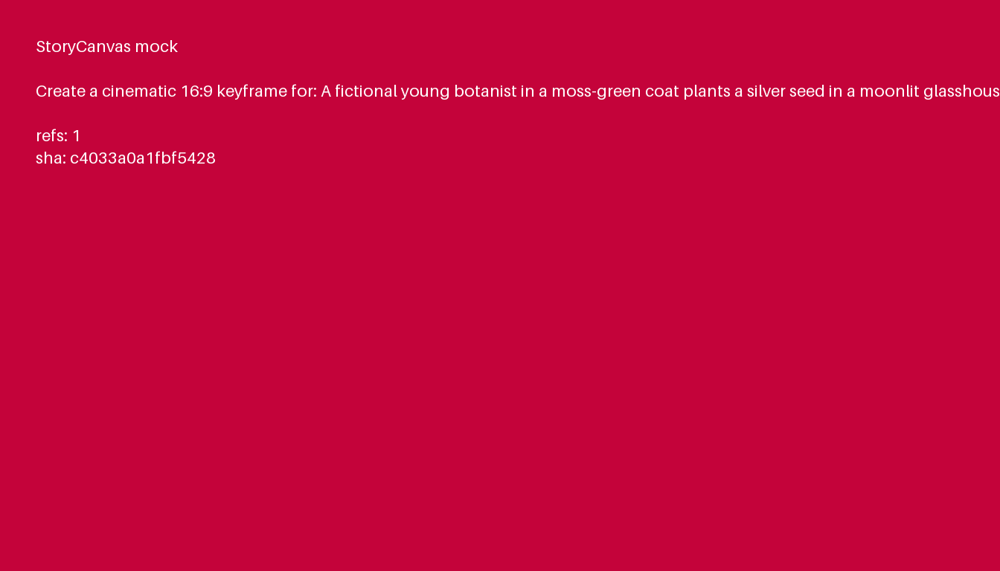
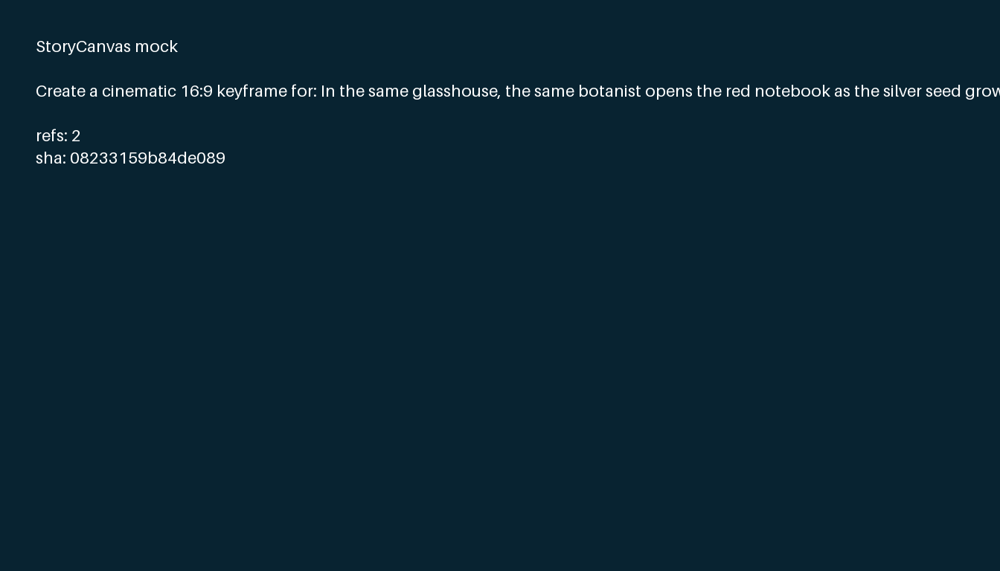
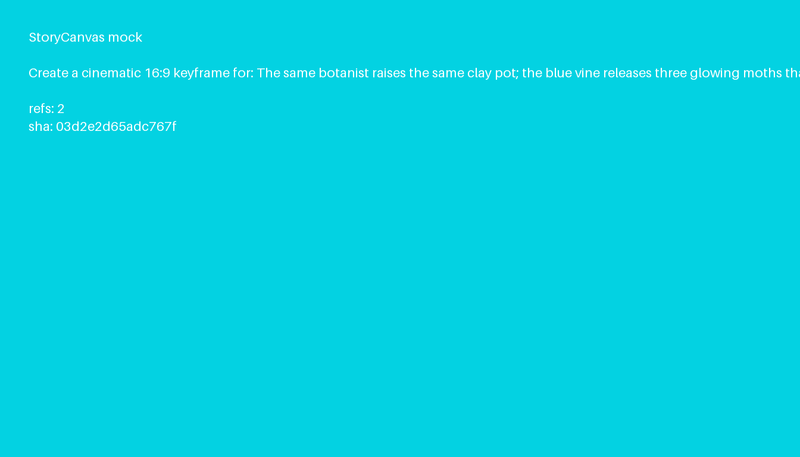

<div align="center">
  
  <h1>ComfyUI StoryCanvas Harness</h1>
  <p><strong>Turn a story into an auditable, editable multi-reference ComfyUI canvas.</strong></p>
  <p>
    <a href="README_ZH.md">中文</a> ·
    <a href="docs/ARCHITECTURE.md">Architecture</a> ·
    <a href="docs/COMFYUI.md">ComfyUI guide</a> ·
    <a href="examples/three_shot_story/audit.html">Audit example</a>
  </p>
  <p>
    <a href="https://github.com/Mrakas/ComfyUI-StoryCanvas-Harness/actions/workflows/ci.yml"></a>
    <a href="LICENSE"></a>
  </p>
</div>

StoryCanvas Harness is not a video model. It is the control and provenance layer between a planning agent, visual research/image tools, and a video backend. A typed Director turns free text or structured shots into a validated `CanvasPlan`; a deterministic compiler turns that plan into a native ComfyUI workflow with one expandable subgraph per shot; execution records every prompt, ordered reference, receipt, SHA-256, retry, and output.

The result is a real ComfyUI canvas that you can inspect, edit, and queue—not a screenshot of an agent trace and not arbitrary workflow JSON emitted by an LLM.

> **Alpha / research preview.** The default mode is `plan_only`. Image, search, and paid video calls stay locked until explicitly enabled. Review generated plans and provider terms before production use.

## Why this exists

Most node workflows are manually authored, while many story agents hide their decisions behind a single “generate” button. StoryCanvas occupies the missing middle:

| Capability | Manual ComfyUI graph | Opaque story agent | StoryCanvas Harness |
|---|---:|---:|---:|
| Editable node canvas | Yes | Usually no | Yes |
| Story-level planning | Manual | Yes | Typed Director |
| Explicit image dependency DAG | Manual | Often hidden | Yes |
| Ordered multi-reference binding | Manual | Often implicit | Yes, with SHA |
| Cost gate before execution | Manual | Varies | Built in |
| Prompt / receipt / provenance audit | Manual | Varies | First-class |
| Provider portability | High | Varies | Provider interfaces + API graph |

ComfyUI remains the visual runtime. The agent proposes *what should exist and why*; the compiler owns *how that intent becomes a valid graph*. This separation prevents malformed or unreviewable LLM-authored workflows.

## What you get

- A strict `storycanvas/v1` Pydantic schema for shots, Visual Bible assets, dependencies, prompts, and execution policy.
- OpenAI Responses Director with structured output, factual `web_search`, OpenAI image generation/editing, optional Serper visual search, and a resumable MiniMax-H3-compatible video adapter.
- Native ComfyUI subgraphs: shared Visual Bible assets stay at the top level; every shot opens into its own Canvas → H3 graph.
- Both UI workflow JSON and flat API-format workflow JSON.
- Safe execution modes:
  - `plan_only` — no search, image, or video calls.
  - `assets` — search and image generation within explicit limits.
  - `full` — assets plus video, requiring `allow_paid_video=true`.
- Resume-safe receipts. A persisted paid video task ID is authoritative; ambiguous task creation is never blindly retried.
- A Python SDK, CLI, REST service, ComfyUI custom nodes, and a browser-side “Build StoryCanvas…” dialog.

## The canvas

```text
Story / Shot Input ──┐
                     ├─ Typed Director Plan ── Shared Visual Bible / Assets
Execution Policy ────┘                              │
                                                   ├─ Shot 01 subgraph ──┐
                                                   ├─ Shot 02 subgraph ──┼─ Assemble ── Manifest
                                                   └─ Shot 03 subgraph ──┘

Inside each shot subgraph:
ordered references → final Canvas keyframe → H3 reference pack → six-part H3 prompt → video
```

The three-shot example has a real dependency chain: Shot 2 consumes Shot 1 only because the location and visible state persist; Shot 3 consumes Shot 2. Independent shots and reusable Visual Bible assets can run in parallel.

## Quick start

### 1. Install as a ComfyUI custom node

```bash
cd /path/to/ComfyUI/custom_nodes
git clone https://github.com/Mrakas/ComfyUI-StoryCanvas-Harness.git
cd ComfyUI-StoryCanvas-Harness
python -m pip install -r requirements.txt
```

Restart ComfyUI. Then choose **Extensions → StoryCanvas → Build StoryCanvas…** or use the canvas context menu. Build a preview, review exact call counts and warnings, then apply it to a **new workflow tab**. Nothing is queued automatically.

Native shot subgraphs require ComfyUI frontend 1.24.3 or newer. See the official [subgraph guide](https://docs.comfy.org/interface/features/subgraph) and [custom-node installation guide](https://docs.comfy.org/installation/install_custom_node).

### 2. Try the credential-free CLI

```bash
git clone https://github.com/Mrakas/ComfyUI-StoryCanvas-Harness.git
cd ComfyUI-StoryCanvas-Harness
uv sync --extra dev

# Typed offline preview; no network or media calls.
STORYCANVAS_PROVIDER_MODE=mock uv run storycanvas plan \
  --kind shot \
  --prompt "A fictional clockmaker repairs a tiny mechanical bird."

# Generate deterministic mock keyframes and receipts.
STORYCANVAS_PROVIDER_MODE=mock uv run storycanvas run \
  --kind story \
  --input examples/three_shot_story/input.json \
  --mode assets --max-shots 3 --max-image-calls 4
```

### 3. Configure real providers

```bash
cp .env.example .env
# Export variables through your shell or secret manager. The project does not load
# or serialize secret values into workflow JSON, manifests, HTML, or logs.
export OPENAI_API_KEY="..."
export OPENAI_TEXT_MODEL="gpt-5"
export OPENAI_IMAGE_MODEL="gpt-image-1"
```

For video, configure a MiniMax-H3-compatible service:

```bash
export MINIMAX_H3_API_KEY="..."
export MINIMAX_H3_BASE_URL="https://your-compatible-service.example"
export MINIMAX_H3_MODEL="MiniMax-H3"
```

Then explicitly unlock the paid path:

```bash
uv run storycanvas run --plan canvas_plan.json \
  --mode full --allow-paid-video \
  --max-image-calls 16 --max-video-calls 12
```

The adapter follows the public protocol implemented by [`ComfyUI-MiniMaxH3-API`](https://github.com/meta-sota/ComfyUI-MiniMaxH3-API/tree/0d1c72b1d80a54237b40adb111ae74d7fe38f4b4). Provider availability, pricing, moderation, and model behavior are outside this repository.

## Examples

All checked-in media are fictional, deterministic mock assets. They exercise the exact schemas and compiler without spending money or redistributing benchmark data.

| Example | Input | Canvas workflow | API workflow | Prompt audit | Manifest |
|---|---|---|---|---|---|
| One 10-second shot | [input](examples/single_shot/input.json) | [workflow](examples/single_shot/workflow.json) | [API graph](examples/single_shot/workflow_api.json) | [JSONL](examples/single_shot/prompts.jsonl) | [manifest](examples/single_shot/run_manifest.json) |
| Three-shot story | [input](examples/three_shot_story/input.json) | [workflow](examples/three_shot_story/workflow.json) | [API graph](examples/three_shot_story/workflow_api.json) | [JSONL](examples/three_shot_story/prompts.jsonl) | [manifest](examples/three_shot_story/run_manifest.json) |

<p align="center">
  
  
  
</p>

Regenerate and verify them:

```bash
uv run python scripts/build_examples.py
(cd examples/single_shot && shasum -a 256 -c MANIFEST.sha256)
(cd examples/three_shot_story && shasum -a 256 -c MANIFEST.sha256)
```

## Python SDK

```python
from storycanvas_harness import ExecutionPolicy, ShotInput, StoryCanvas

canvas = StoryCanvas.from_environment(runs_dir="./runs")
plan = canvas.plan(
    ShotInput(prompt="A fictional paper fox follows a trail of blue lanterns."),
    ExecutionPolicy(),  # plan_only by default
)
compiled = canvas.compile_workflow(plan)

print(plan.call_estimate)
print(compiled.workflow_sha256)
```

The standalone REST service exposes:

```text
POST /storycanvas/v1/plans
GET  /storycanvas/v1/plans/{plan_id}
POST /storycanvas/v1/workflows
POST /storycanvas/v1/runs
GET  /storycanvas/v1/runs/{job_id}
GET  /storycanvas/v1/runs/{job_id}/events
```

Run it with `uv run storycanvas serve --host 127.0.0.1 --port 8189`. See [docs/API.md](docs/API.md).

## Trust and execution model

1. The Director can only return the typed `DirectorDraft` schema.
2. The harness converts it into a validated `CanvasPlan`; unsafe IDs, unknown dependencies, non-contiguous shots, and reference-limit violations are rejected.
3. The deterministic compiler emits only allowlisted StoryCanvas node classes.
4. The user sees predicted call counts and warnings before changing the canvas.
5. “Apply” opens a new workflow tab and preserves the existing canvas.
6. ComfyUI queues only when the user requests it.
7. Every output is tied to its actual prompt, ordered reference SHA list, provider receipt, and output SHA.

Search and provider traffic is opt-in. Visual-search downloads require public HTTPS, reject private/reserved network addresses, reject non-image content, cap downloads at 20 MiB, and re-encode decoded pixels. See [SECURITY.md](SECURITY.md) and [docs/SECURITY_MODEL.md](docs/SECURITY_MODEL.md).

## Repository map

```text
storycanvas_harness/
  schemas.py             typed planning and audit contract
  providers/             Director, search, image, and video adapters
  engine.py              policy gate, DAG scheduler, cache, receipts
  workflow.py            deterministic ComfyUI UI/API compiler
  comfy_nodes.py         ten custom node implementations
  comfy_api.py            routes hosted inside ComfyUI
  api.py / cli.py         standalone REST and CLI surfaces
web/js/storycanvas.js     Build → preview → apply-to-new-tab UI
examples/                 fictional, reproducible example artifacts
tests/                    schema, compiler, engine, API, and node tests
```

The Markdown files document behavior, but they do not drive the runtime. The enforcement lives in typed schemas, provider adapters, the dependency scheduler, deterministic compiler, and tests.

## Development

```bash
uv sync --extra dev
uv run ruff check .
uv run mypy -p storycanvas_harness
uv run pytest
```

See [CONTRIBUTING.md](CONTRIBUTING.md) before proposing a provider or schema change. The public repository intentionally excludes private benchmark data, generated research outputs, internal GPU/cluster scripts, credentials, and third-party model weights.

## Status and limits

- v0.1 targets one 10-second shot or up to 24 story shots per ComfyUI workflow.
- Canvas keyframes accept at most five ordered references; H3 video requests accept one to nine.
- The checked-in examples use mock assets. They prove graph/audit behavior, not visual quality.
- Provider APIs can change. Pin revisions in production and retain receipts.
- This is not an official OpenAI, ComfyUI, MiniMax, or Serper project.

See [docs/LIMITATIONS.md](docs/LIMITATIONS.md) for the full list.

## License

Apache-2.0. See [LICENSE](LICENSE) and [NOTICE](NOTICE).
