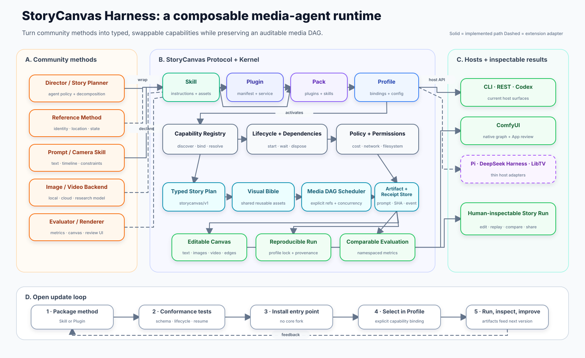

# Architecture

StoryCanvas Harness separates probabilistic planning from deterministic execution.



This 28-node topology is the engineering companion to the repository's canonical
[13-node Figure 1](../figures/storycanvas-figure1.svg). Both are generated from checked-in JSON
specs. The compatibility providers below are also exposed through the Plugin/Profile composition
layer; see [PLUGIN_ARCHITECTURE.md](PLUGIN_ARCHITECTURE.md).

```text
free text / structured story
            │
            ▼
  DirectorProvider (LLM or offline)
            │ strict DirectorDraft
            ▼
     CanvasPlan validation
            │
       ┌────┴───────────────┐
       ▼                    ▼
ComfyUI compiler       Execution engine
 UI + API graph        policy + DAG + cache
       │                    │
       └──────────┬─────────┘
                  ▼
 prompts / receipts / SHA / manifest / audit HTML
```

## Why the model does not emit ComfyUI JSON

ComfyUI workflows contain node IDs, slot indices, links, widget values, subgraph definitions, and backend class names. Letting a language model author this serialization directly makes correctness hard to validate and turns provider output into executable structure.

The Director can only return `DirectorDraft`, a Pydantic model describing:

- the Visual Bible;
- reusable character, location, prop, and style assets;
- the exact image prompt for each asset and shot;
- the explicit dependencies for each shot;
- ordered reference intent;
- a six-part H3 video prompt.

`draft_to_plan()` resolves user references and dependencies, enforces the five-image Canvas limit, attaches provenance, and produces a `CanvasPlan`. `workflow.py` is the only component allowed to create ComfyUI nodes and links.

## Context design

The production Director performs one structured planning call per story. It receives the original story, structured references, and numeric limits—not the growing execution log. Search, image generation, polling, retries, and cache recovery run outside the LLM context.

This avoids an ever-growing “agent conversation.” State is represented by small typed artifacts:

- `canvas_plan.json`
- per-operation receipt JSON
- `prompts.jsonl`
- media files and SHA-256 values
- `run_manifest.json`

If a run resumes, it validates these files rather than replaying the story through the agent.

## Dependency semantics

The Canvas is a DAG, not necessarily a chain.

- Style, location, character-state, and reusable prop assets can run concurrently when they have no dependencies.
- A final shot keyframe waits only for references explicitly listed in that shot.
- `previous_shot` is added only when the Director says visible scene/state should persist.
- A location change should normally break the prior-frame chain and continue from Visual Bible anchors.
- The engine schedules ready assets up to `max_concurrency`; failed dependencies block only their descendants.

The deterministic offline Director intentionally chains its demo shots so the examples make the dependency behavior visible. A production Director may produce parallel shot branches.

## Two workflow representations

`CompiledWorkflow` contains:

1. `workflow`: the editable ComfyUI UI serialization, including native subgraph definitions.
2. `api_workflow`: the flat prompt graph where node IDs map to `{class_type, inputs}`.

The UI workflow prioritizes human comprehension. Shared assets remain visible at the root; each shot is an expandable subgraph. The API workflow prioritizes queue execution and uses only the ten allowlisted StoryCanvas classes.

## Execution modes

| Mode | Planning | Search | Images | Video |
|---|---:|---:|---:|---:|
| `plan_only` | Yes | No | No | No |
| `assets` | Yes | Explicit budget | Explicit budget | No |
| `full` | Yes | Explicit budget | Explicit budget | Only with `allow_paid_video=true` |

Preflight rejects a plan before provider calls if it exceeds any configured limit or requires a provider that is not configured.

## Artifact identity and recovery

Image cache identity includes provider, model, actual prompt, ordered reference SHA list, and output name. A cache hit requires both a matching request identity and a matching output SHA.

The MiniMax-H3 adapter persists request SHA and task ID before polling. A persisted task ID is reused. If task creation has an ambiguous transport outcome and no task ID can be established, the adapter records `create_ambiguous` and stops; it does not risk submitting a duplicate paid task.

## Standalone Canvas protocol

`storycanvas/canvas/v1` is the host-neutral, read-only projection of a completed `CanvasPlan` and
`RunManifest`. `export_story_canvas()` verifies every declared path, SHA, image, and fully decoded
video before emitting `canvas_graph.json`, a self-contained `index.html`, content-addressed local
`media/`, and `export_report.json`.

The graph exposes stages, typed nodes, dependency edges, prompt summaries, provenance, and receipt
hashes without carrying credentials, machine-local paths, or remote provider identifiers. The
Viewer uses no CDN and makes no provider calls. It is deliberately separate from the ComfyUI
compiler: ComfyUI remains an execution host, while the standalone Canvas is a portable review and
communication artifact.

## Provenance contract

The public provenance enum distinguishes:

- `user_reference`
- `official_reference`
- `fact_search`
- `visual_search`
- `image_generation`
- `previous_shot`
- `generated_canvas`

Every generated artifact can contain planned Prompt, actual Prompt, Prompt SHA, input mode (`text` or `text+image`), ordered reference records, provider receipt, attempts, output SHA, and operation metadata.

## Extension points

Compatibility provider protocols live in `providers/base.py`:

- `DirectorProvider`
- `FactSearchProvider`
- `VisualSearchProvider`
- `ImageProvider`
- `VideoProvider`

A provider implementation should not bypass `ExecutionPolicy`, write secrets to receipts, reorder references, or silently retry ambiguous paid creation. See [PROVIDERS.md](PROVIDERS.md).

New community integrations should normally publish a `storycanvas/plugin/v1`
manifest and a zero-argument factory under the `storycanvas.plugins` entry-point
group. The Profile names the Plugin and binds each capability explicitly. This
keeps model SDKs and host-specific code outside the Kernel while preserving the
same policy, DAG, Artifact, Receipt, and cleanup invariants.
