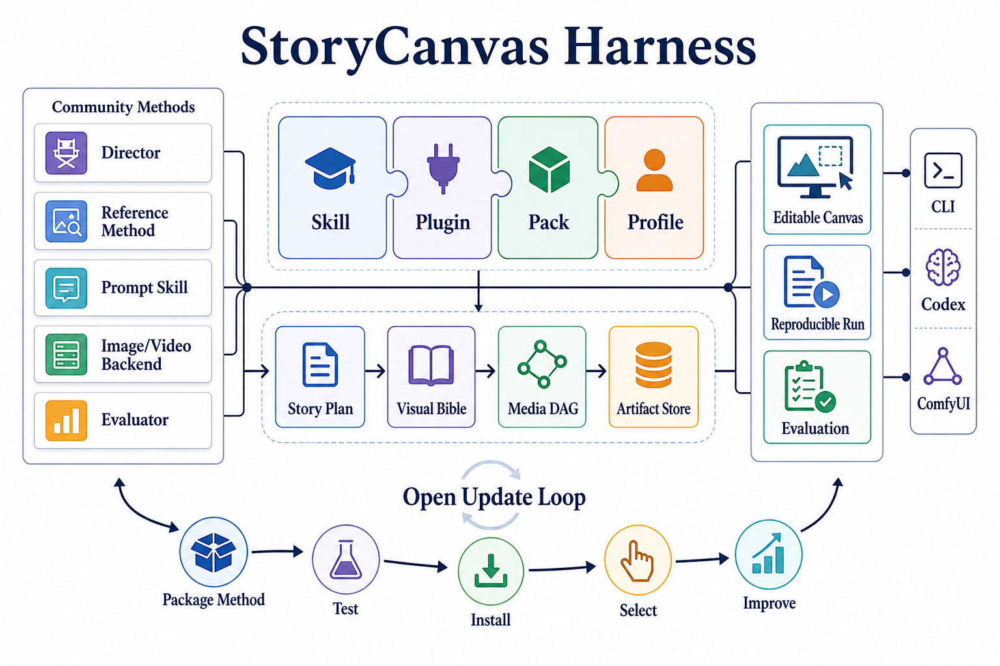
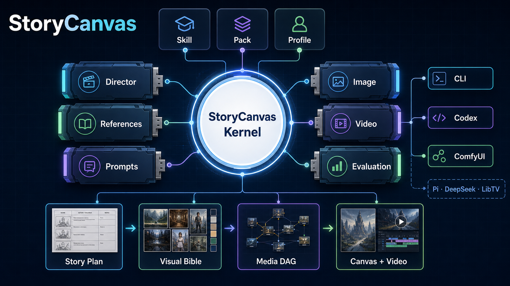
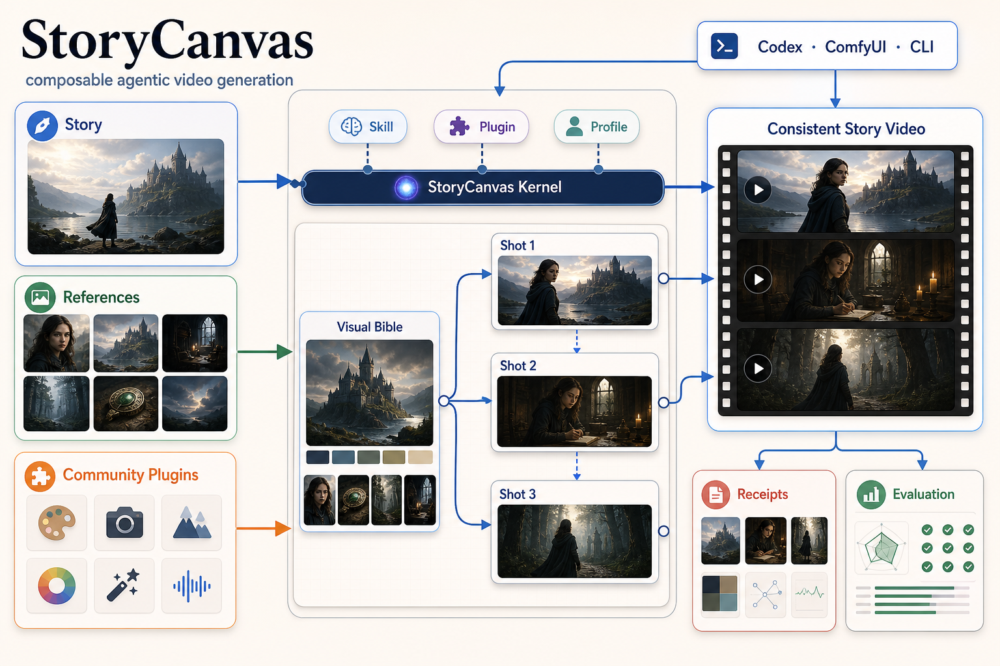

# ImageGen architecture concepts

These project-local bitmap concepts were generated with the built-in ImageGen
workflow on 2026-08-30. They are communication assets, not normative protocol
specifications. The deterministic technical source of truth remains
[`../storycanvas-figure1.svg`](../storycanvas-figure1.svg).

| Concept | Intended use | Preview |
|---|---|---|
| Academic | Paper-style Figure 1 with the full composition and update loop |  |
| Kernel | Dark developer-tool hero emphasizing the small kernel and plug-in ports |  |
| Media DAG | README hero emphasizing references, visible image dependencies, and video output |  |

## Prompt directions

- **Academic:** community methods → Skill/Plugin/Pack/Profile → typed media DAG
  → editable/reproducible/evaluable outputs, with an open update loop.
- **Kernel:** a small central StoryCanvas Kernel surrounded by swappable Director,
  References, Prompts, Image, Video, and Evaluation cartridges.
- **Media DAG:** Story, References, and Community Plugins feed a Visual Bible and
  three dependent shots, producing a consistent story video with receipts and
  evaluation.

ImageGen can introduce minor decorative or textual deviations. Do not derive API
or execution semantics from these bitmaps; use the protocol specification and
deterministic SVG instead.
